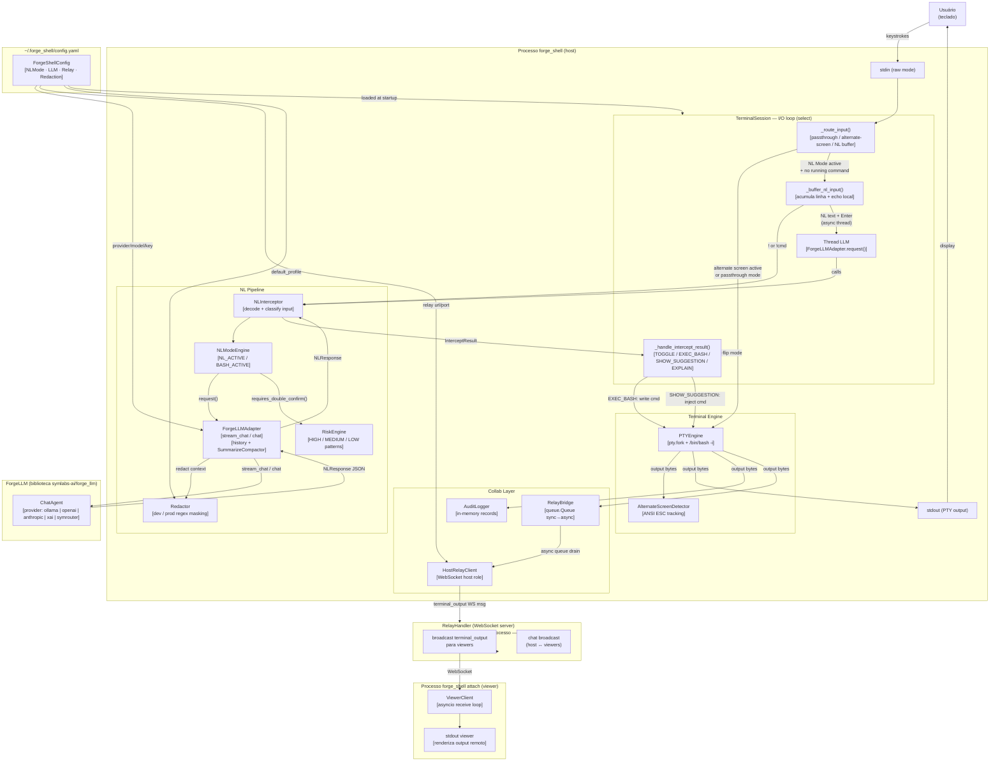

# Architecture Diagram — forge_shell

Arquitetura de runtime: como o input do usuário flui do teclado até o PTY e como o NL pipeline e o relay colaborativo se encaixam na sessão.

```mermaid
flowchart TD
    USER["Usuário\n(teclado)"]

    subgraph HOST["Processo forge_shell (host)"]
        direction TB

        STDIN["stdin (raw mode)"]

        subgraph SESSION["TerminalSession — I/O loop (select)"]
            direction LR
            ROUTE["_route_input()\n[passthrough / alternate-screen / NL buffer]"]
            NLBUF["_buffer_nl_input()\n[acumula linha + echo local]"]
            LLM_THR["Thread LLM\n[ForgeLLMAdapter.request()]"]
            HANDLE["_handle_intercept_result()\n[TOGGLE / EXEC_BASH / SHOW_SUGGESTION / EXPLAIN]"]
        end

        subgraph NL_PIPELINE["NL Pipeline"]
            direction TB
            NLI["NLInterceptor\n[decode + classify input]"]
            NLE["NLModeEngine\n[NL_ACTIVE / BASH_ACTIVE]"]
            LLMA["ForgeLLMAdapter\n[stream_chat / chat]\n[history + SummarizeCompactor]"]
            RE["RiskEngine\n[HIGH / MEDIUM / LOW patterns]"]
            RED["Redactor\n[dev / prod regex masking]"]
        end

        subgraph PTY_ENGINE["Terminal Engine"]
            direction TB
            PTY["PTYEngine\n[pty.fork + /bin/bash -i]"]
            ASD["AlternateScreenDetector\n[ANSI ESC tracking]"]
        end

        subgraph COLLAB["Collab Layer"]
            direction TB
            RB["RelayBridge\n[queue.Queue sync→async]"]
            HRC["HostRelayClient\n[WebSocket host role]"]
            AL["AuditLogger\n[in-memory records]"]
        end

        STDOUT["stdout (PTY output)"]
    end

    subgraph RELAY["RelayHandler (WebSocket server)\n[pode rodar no mesmo processo — thread daemon]"]
        BCAST["broadcast terminal_output\npara viewers"]
        CHAT["chat broadcast\n(host ↔ viewers)"]
    end

    subgraph VIEWER["Processo forge_shell attach (viewer)"]
        VC["ViewerClient\n[asyncio receive loop]"]
        VOUT["stdout viewer\n[renderiza output remoto]"]
    end

    subgraph FORGE["ForgeLLM (biblioteca symlabs-ai/forge_llm)"]
        AGENT["ChatAgent\n[provider: ollama | openai | anthropic | xai | symrouter]"]
    end

    subgraph CONFIG["~/.forge_shell/config.yaml"]
        CFG["ForgeShellConfig\n[NLMode · LLM · Relay · Redaction]"]
    end

    %% ── Input flow ──────────────────────────────────────────
    USER -->|"keystrokes"| STDIN
    STDIN --> ROUTE
    ROUTE -->|"alternate screen active\nor passthrough mode"| PTY
    ROUTE -->|"NL Mode active\n+ no running command"| NLBUF
    NLBUF -->|"! or !cmd"| NLI
    NLBUF -->|"NL text + Enter\n(async thread)"| LLM_THR
    LLM_THR -->|"calls"| NLI
    NLI --> NLE
    NLE -->|"request()"| LLMA
    NLE -->|"requires_double_confirm()"| RE
    LLMA -->|"redact context"| RED
    LLMA -->|"stream_chat / chat"| AGENT
    AGENT -->|"NLResponse JSON"| LLMA
    LLMA -->|"NLResponse"| NLI
    NLI -->|"InterceptResult"| HANDLE
    HANDLE -->|"EXEC_BASH: write cmd"| PTY
    HANDLE -->|"SHOW_SUGGESTION: inject cmd"| PTY
    HANDLE -->|"TOGGLE: flip mode"| SESSION

    %% ── PTY output flow ─────────────────────────────────────
    PTY -->|"output bytes"| ASD
    PTY -->|"output bytes"| STDOUT
    STDOUT -->|"display"| USER
    PTY -->|"output bytes"| AL
    PTY -->|"output bytes"| RB

    %% ── Relay flow ──────────────────────────────────────────
    RB -->|"async queue drain"| HRC
    HRC -->|"terminal_output WS msg"| RELAY
    RELAY --> BCAST
    BCAST -->|"WebSocket"| VC
    VC --> VOUT

    %% ── Config ──────────────────────────────────────────────
    CFG -->|"loaded at startup"| SESSION
    CFG -->|"provider/model/key"| LLMA
    CFG -->|"relay url/port"| HRC
    CFG -->|"default_profile"| RED
```
