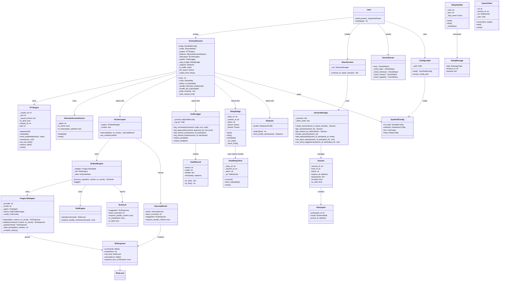

# Class Diagram — sym_shell

As principais classes do sistema e seus relacionamentos, derivados do código em `src/`.

```mermaid
classDiagram
    %% ── CLI ──────────────────────────────────────────────────
    class main {
        +build_parser() ArgumentParser
        +main(argv) int
    }

    %% ── Application — Use Cases ──────────────────────────────
    class TerminalSession {
        -config: SymShellConfig
        -_mode: SessionMode
        -_engine: PTYEngine
        -_detector: AlternateScreenDetector
        -_interceptor: NLInterceptor
        -_auditor: AuditLogger
        -_relay_bridge: RelayBridge
        -_redactor: Redactor
        -_nl_buffer: bytes
        -_llm_queue: Queue
        -_output_lines: deque
        +run() int
        -_route_input(data)
        -_buffer_nl_input(data)
        -_handle_intercept_result(result)
        -_handle_pty_output(data)
        -_build_context() dict
        -_write_startup_hint()
    }

    class NLInterceptor {
        -_engine: NLModeEngine
        -_context: dict
        +intercept(data, on_chunk) InterceptResult
        +set_context(context)
    }

    class NLModeEngine {
        -_adapter: ForgeLLMAdapter
        -_risk: RiskEngine
        -_state: NLModeState
        +process_input(text, context, on_chunk) NLResult
        +toggle()
    }

    class ShareSession {
        -_sm: SessionManager
        +run(host_id, expire_minutes) dict
    }

    class DoctorRunner {
        +run() DoctorReport
        -_check_pty() CheckStatus
        -_check_termios() CheckStatus
        -_check_resize() CheckStatus
        -_check_signals() CheckStatus
    }

    %% ── Domain / Value Objects ───────────────────────────────
    class InterceptResult {
        +action: InterceptAction
        +bash_command: str
        +suggestion: NLResponse
        +requires_double_confirm: bool
    }

    class NLResult {
        +suggestion: NLResponse
        +bash_command: str
        +requires_double_confirm: bool
        +is_explanation: bool
        +is_help: bool
    }

    class NLResponse {
        +commands: list[str]
        +explanation: str
        +risk_level: RiskLevel
        +assumptions: list[str]
        +required_user_confirmation: bool
    }

    class AuditRecord {
        +action: str
        +origin: str
        +details: dict
        +timestamp: datetime
        +to_dict() dict
        +to_text() str
    }

    class Session {
        +session_id: str
        +host_id: str
        +token: str
        +expires_at: datetime
        +participants: dict
        +revoked: bool
        +is_valid: bool
    }

    class Participant {
        +participant_id: str
        +mode: SessionMode
        +joined_at: datetime
    }

    class RelayMessage {
        +type: MessageType
        +session_id: str
        +payload: dict
    }

    %% ── Infrastructure — Terminal ────────────────────────────
    class PTYEngine {
        -_master_fd: int
        -_pid: int
        -_saved_termios: list
        +spawn(shell)
        +write(data)
        +read_available(timeout) bytes
        +resize(rows, cols)
        +set_raw_stdin()
        +restore_stdin()
        +close()
        +is_alive: bool
        +master_fd: int
        +pid: int
    }

    class AlternateScreenDetector {
        -_depth: int
        +feed(data)
        +reset()
        +is_active: bool
        +nl_interception_allowed: bool
    }

    %% ── Infrastructure — Intelligence ────────────────────────
    class ForgeLLMAdapter {
        -_provider: str
        -_model: str
        -_agent: ChatAgent
        -_history: list[ChatMessage]
        -_config: ChatConfig
        +request(text, context, on_chunk) NLResponse
        +explain(command, context, on_chunk) NLResponse
        -_parse(content) NLResponse
        -_build_prompt(text, context) str
        -_compact_history()
    }

    class RiskEngine {
        +classify(command) RiskLevel
        +requires_double_confirm(command) bool
    }

    class Redactor {
        +profile: RedactionProfile
        +redact(text) str
        +from_profile_name(name) Redactor
    }

    %% ── Infrastructure — Collab ──────────────────────────────
    class SessionManager {
        -_sessions: dict
        -_token_index: dict
        +create_session(host_id, expire_minutes) Session
        +get_session(session_id) Session
        +get_session_by_token(token) Session
        +revoke_session(session_id)
        +add_participant(session_id, participant_id, mode)
        +can_inject_input(session_id, participant_id) bool
        +can_send_suggestions(session_id, participant_id) bool
    }

    class RelayHandler {
        -_host: str
        -_port: int
        -_stop_event: Event
        +start()
        +stop()
        -_handle(ws)
    }

    class RelayBridge {
        -_relay_url: str
        -_session_id: str
        -_token: str
        -_queue: Queue
        -_thread: Thread
        +start()
        +stop()
        +send(data)
        -_run_loop()
        -_async_loop()
    }

    class HostRelayClient {
        -_relay_url: str
        -_session_id: str
        -_token: str
        -_ws: WebSocket
        +connect()
        +send_output(data)
        +close()
    }

    class ViewerClient {
        -_url: str
        -_session_id: str
        -_ws: WebSocket
        -_task: Task
        +connect(on_output)
        +wait()
        +close()
    }

    %% ── Infrastructure — Audit ───────────────────────────────
    class AuditLogger {
        -_records: list[AuditRecord]
        -_log_dir: Path
        +log_command(command, origin, exit_code)
        +log_approval(command, approved_by, risk_level)
        +log_session_join(session_id, participant)
        +log_session_leave(session_id, participant)
        +export_json(path)
        +export_text(path)
    }

    %% ── Config ───────────────────────────────────────────────
    class SymShellConfig {
        +nl_mode: NLModeConfig
        +redaction: RedactionConfig
        +llm: LLMConfig
        +relay: RelayConfig
    }

    class ConfigLoader {
        -_path: Path
        +load() SymShellConfig
        +ensure_config_dir()
    }

    %% ── Relationships ─────────────────────────────────────────
    main --> TerminalSession : creates
    main --> ShareSession : creates
    main --> DoctorRunner : creates
    main --> ConfigLoader : uses

    TerminalSession --> PTYEngine : owns
    TerminalSession --> AlternateScreenDetector : owns
    TerminalSession --> NLInterceptor : injects (DI)
    TerminalSession --> AuditLogger : injects (DI)
    TerminalSession --> RelayBridge : injects (DI)
    TerminalSession --> Redactor : injects (DI)
    TerminalSession --> SymShellConfig : reads

    NLInterceptor --> NLModeEngine : owns
    NLInterceptor --> InterceptResult : returns
    NLModeEngine --> ForgeLLMAdapter : owns
    NLModeEngine --> RiskEngine : owns
    NLModeEngine --> NLResult : returns

    ForgeLLMAdapter --> NLResponse : returns
    NLResponse --> RiskLevel
    InterceptResult --> NLResponse : contains

    AuditLogger --> AuditRecord : creates

    SessionManager --> Session : manages
    Session --> Participant : contains
    ShareSession --> SessionManager : uses

    RelayBridge --> HostRelayClient : owns (async thread)
    RelayHandler --> RelayMessage : processes

    ConfigLoader --> SymShellConfig : builds
```
