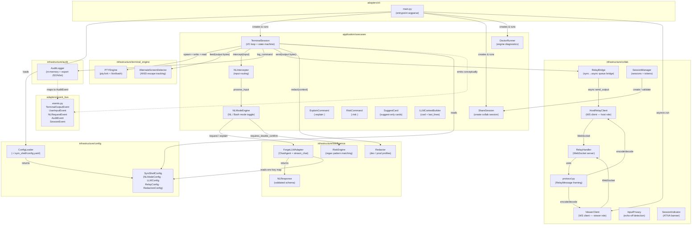

# Components Diagram — sym_shell

Componentes do sistema e como eles se conectam, refletindo a estrutura de pacotes em `src/`.

```mermaid
flowchart TD
    subgraph CLI["adapters/cli"]
        MAIN["main.py\n(entrypoint argparse)"]
    end

    subgraph EVENTS["adapters/event_bus"]
        EV["events.py\nTerminalOutputEvent\nUserInputEvent\nNLRequestEvent\nAuditEvent\nSessionEvent"]
    end

    subgraph APP["application/usecases"]
        TS["TerminalSession\n(I/O loop + state machine)"]
        NLI["NLInterceptor\n(input routing)"]
        NLE["NLModeEngine\n(NL / Bash mode toggle)"]
        SS["ShareSession\n(create collab session)"]
        DR["DoctorRunner\n(engine diagnostics)"]
        EXP["ExplainCommand\n(:explain <cmd>)"]
        RISK_UC["RiskCommand\n(:risk <cmd>)"]
        SC["SuggestCard\n(suggest-only cards)"]
        CTX["LLMContextBuilder\n(cwd + last_lines)"]
    end

    subgraph INFRA_T["infrastructure/terminal_engine"]
        PTY["PTYEngine\n(pty.fork + /bin/bash)"]
        ASD["AlternateScreenDetector\n(ANSI escape tracking)"]
    end

    subgraph INFRA_I["infrastructure/intelligence"]
        LLM["ForgeLLMAdapter\n(ChatAgent + stream_chat)"]
        RE["RiskEngine\n(regex pattern matching)"]
        RED["Redactor\n(dev / prod profiles)"]
        NLR["NLResponse\n(validated schema)"]
    end

    subgraph INFRA_C["infrastructure/collab"]
        RH["RelayHandler\n(WebSocket server)"]
        HRC["HostRelayClient\n(WS client — host role)"]
        VC["ViewerClient\n(WS client — viewer role)"]
        RB["RelayBridge\n(sync→async queue bridge)"]
        SM["SessionManager\n(sessions + tokens)"]
        PROT["protocol.py\n(RelayMessage framing)"]
        IP["InputPrivacy\n(echo-off detection)"]
        SI["SessionIndicator\n(ATIVA banner)"]
    end

    subgraph INFRA_A["infrastructure/audit"]
        AL["AuditLogger\n(in-memory + export JSON/txt)"]
    end

    subgraph INFRA_CFG["infrastructure/config"]
        CL["ConfigLoader\n(~/.sym_shell/config.yaml)"]
        CFG["SymShellConfig\n(NLModeConfig · LLMConfig\nRelayConfig · RedactionConfig)"]
    end

    %% ── CLI wiring ──────────────────────────────────────────
    MAIN -->|"loads"| CL
    CL -->|"returns"| CFG
    MAIN -->|"creates & runs"| TS
    MAIN -->|"creates & runs"| SS
    MAIN -->|"creates & runs"| DR
    MAIN -->|"asyncio.run"| VC

    %% ── TerminalSession core ────────────────────────────────
    TS -->|"spawn + write + read"| PTY
    TS -->|"feed(output bytes)"| ASD
    TS -->|"intercept(input)"| NLI
    TS -->|"log_command"| AL
    TS -->|"send(output bytes)"| RB
    TS -->|"redact(context)"| RED
    TS -->|"reads"| CFG

    %% ── NL pipeline ─────────────────────────────────────────
    NLI -->|"process_input"| NLE
    NLE -->|"request / explain"| LLM
    NLE -->|"requires_double_confirm"| RE
    LLM -->|"returns"| NLR
    LLM -->|"reads env key map"| CFG

    %% ── Collab pipeline ─────────────────────────────────────
    RB -->|"async send_output"| HRC
    HRC -->|"WebSocket"| RH
    VC -->|"WebSocket"| RH
    RH -->|"uses"| PROT
    SM -->|"create / validate"| SS
    PROT -->|"encode/decode"| HRC
    PROT -->|"encode/decode"| VC

    %% ── Events (used by components as value types) ──────────
    TS -.->|"emits conceptually"| EV
    AL -.->|"maps to AuditEvent"| EV
```
