# Database / Schema Diagram — sym_shell

O sym_shell não usa banco de dados SQL. Este diagrama representa as estruturas de dados persistentes e em memória: configuração em YAML, registros de auditoria e estado de sessão colaborativa.

```mermaid
erDiagram

    %% ── Config schema (~/.sym_shell/config.yaml) ─────────────
    SymShellConfig {
        NLModeConfig    nl_mode
        RedactionConfig redaction
        LLMConfig       llm
        RelayConfig     relay
    }

    NLModeConfig {
        bool        default_active   "padrão: true"
        int         context_lines    "padrão: 20"
        list_str    var_whitelist    "variáveis de env enviadas ao LLM"
    }

    LLMConfig {
        str_or_null api_key          "null = usa variável de ambiente"
        str         provider         "ollama | openai | anthropic | openrouter | xai | symrouter"
        str         model            "ex: llama3.2, gpt-4o"
        int         timeout_seconds  "padrão: 30"
        int         max_retries      "padrão: 2"
    }

    RelayConfig {
        str  url    "ex: ws://localhost:8060"
        int  port   "padrão: 8060"
        bool tls    "padrão: false"
    }

    RedactionConfig {
        str                            default_profile  "dev | prod"
        dict_RedactionProfileConfig    profiles         "mapa nome→perfil"
    }

    RedactionProfileConfig {
        list_str patterns "lista de regex a mascarar"
    }

    %% ── Audit schema (in-memory + export) ────────────────────
    AuditRecord {
        str      action     "command_executed | command_approved | session_join | session_leave"
        str      origin     "user | llm | remote"
        dict     details    "campos variáveis por action"
        datetime timestamp  "UTC ISO 8601"
    }

    AuditDetails_command {
        str command
        int exit_code
    }

    AuditDetails_approval {
        str command
        str approved_by
        str risk_level
    }

    AuditDetails_session {
        str session_id
        str participant
    }

    %% ── Collab session schema (in-memory no host) ─────────────
    Session {
        str      session_id   "s-<hex8>"
        str      host_id      "identificador do host"
        str      token        "urlsafe random 32 bytes"
        datetime expires_at   "UTC"
        bool     revoked      "padrão: false"
    }

    Participant {
        str      participant_id
        str      mode          "view_only | suggest_only"
        datetime joined_at     "UTC"
    }

    %% ── LLM response schema (in-memory / validated) ──────────
    NLResponse {
        list_str commands                   "comandos bash sugeridos"
        str      explanation                "descrição curta"
        str      risk_level                 "low | medium | high"
        list_str assumptions                "premissas e avisos"
        bool     required_user_confirmation
    }

    %% ── RelayMessage schema (WebSocket framing) ──────────────
    RelayMessage {
        str  type        "terminal_output | chat | suggest | ping | pong | session_join | session_leave | error"
        str  session_id
        dict payload     "conteúdo dependente do type"
    }

    %% ── Relationships ─────────────────────────────────────────
    SymShellConfig ||--|| NLModeConfig       : contains
    SymShellConfig ||--|| LLMConfig          : contains
    SymShellConfig ||--|| RelayConfig        : contains
    SymShellConfig ||--|| RedactionConfig    : contains
    RedactionConfig ||--|{ RedactionProfileConfig : "has profiles"

    Session ||--|{ Participant : "has participants"

    AuditRecord ||--o| AuditDetails_command  : "details when command_executed"
    AuditRecord ||--o| AuditDetails_approval : "details when command_approved"
    AuditRecord ||--o| AuditDetails_session  : "details when session_join/leave"
```

